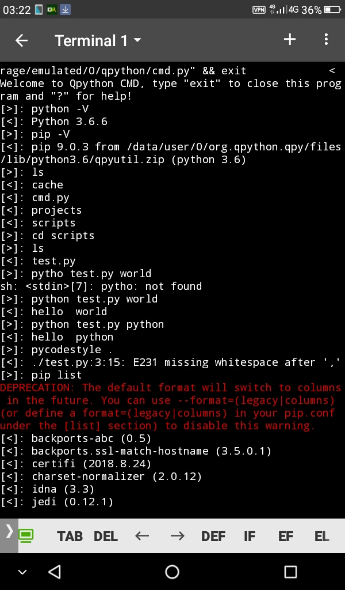

Qpy CMD is terminal helper for qpython user to run terminal operation like:
- execute python script directly (e.g:  `python path/to/script.py arg1 arg2` )
- run  `pip` command.
- run installed package binary ( `pycodestyle` ,  `autopep8` ,  `mypy`  etc)
- run basic command ( `ls` ,  `mkdir` ,  `cd`  etc)
- auto  `cd`  to  `/sdcard/qpython` when launched.

built-in commands:
 -  `x`                         :  prompt gui input.
 -  `?`                         :  show help.
 -  `exit`                     :  terminate program.
 -  `update`               :  self-update program.
 -  `ext`                      :  extension command.
 -  `dump_path`        : dump all available executable.

## Extension

For extension list, please visit https://github.com/guangrei/QPy-EXT