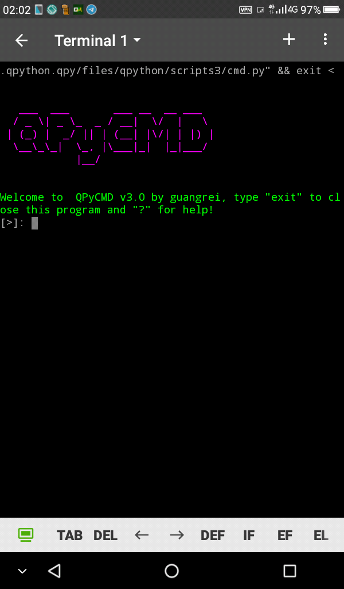

QpyCMD is terminal emulator written in python and designed for python3 mobile.

built-in commands:
 -  `x`                         :  prompt gui input (require sl4a).
 -  `?`                         :  show help.
 -  `exit`                     :  terminate program.
 -  `update`               :  self-update program.
 -  `ext`                      :  extension command.
 -  `dump_path`        : dump all available executable.
  - `nohup` - run extension program in background.



## Installation

Run pip installation with command:
```
pip3 install https://github.com/guangrei/Qpy-CMD/archive/main.zip
```
then in qpython open terminal, if terminal not changed to qpycmd create project named `QpyCMD` and add this code into `main.py`:

```python
# -*-coding:utf8;-*-
import os

os.system("qcmd")
```

## Extension

For extension list, please visit https://github.com/guangrei/QPy-EXT